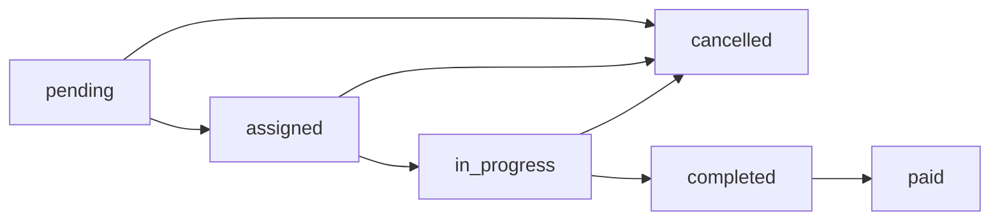

# Путь заказа: от заявки до завершения

## Роли

| Роль | Где | Действия |
|------|-----|----------|
| Клиент | Сайт `qlin.pro` | Регистрация, создание заказа, просмотр своих заказов, отмена (если `pending`) |
| Админ / менеджер | CRM `crm.qlin.pro` | Воронка, список заказов, **назначение уборщика** (`POST /api/v1/admin/orders/{id}/assign`) |
| Уборщик | Сайт / бот / будущий кабинет | Видит заказы, где он `cleaner_id`; дальше — смена статусов (по мере появления API) |

## Статусы (`Order.status`)

- **pending** — только что создан на сайте, исполнитель не назначен.
- **assigned** — в CRM выбран уборщик (`cleaner_id`), клиенту уходит уведомление (если настроены Telegram и т.д.).
- **in_progress** / **completed** / **paid** — этапы выполнения и оплаты (переходы через state machine; отдельные эндпоинты можно добавлять по мере необходимости).

## Технический поток

1. **Создание** — `POST /api/v1/orders` (клиент или админ как «клиент» по договорённости). Запись в `orders`, событие `order_created`, уведомления в таблицу `notifications` для уборщиков с `telegram_id` (если есть).
2. **Назначение** — в CRM менеджер вызывает **`POST /api/v1/admin/orders/{order_id}/assign`** с телом `{ "cleaner_id": "<uuid пользователя-уборщика>" }`. Список кандидатов: **`GET /api/v1/admin/cleaners`**.
3. **Уборщик** — в БД у пользователя `role = cleaner` и есть строка в **`cleaners`** (профиль). Без профиля строка в `/admin/cleaners` не попадёт (join).

## Что настроить в проде

- Создать пользователей-уборщиков и профили `cleaners` (или скрипт seed).
- При необходимости — Telegram для пушей (см. `NotificationService`).
